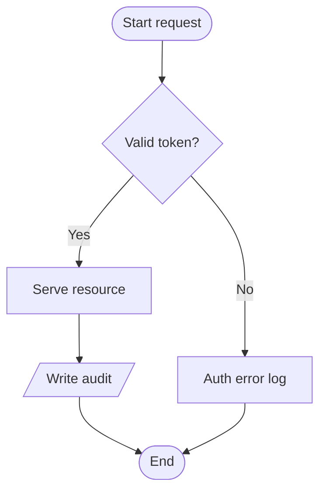

# Mermaid Diagram Coloring Implementation Plan

> **For agentic workers:** REQUIRED SUB-SKILL: Use superpowers:subagent-driven-development (recommended) or superpowers:executing-plans to implement this plan task-by-task. Steps use checkbox (`- [ ]`) syntax for tracking.

**Goal:** Color-code mermaid flowcharts (node role + yes/no branches) and sequence diagrams (per-actor hues) by regex-inferring structure from source and CSS-styling the rendered SVG.

**Architecture:** Extend `src/browser/mermaid.ts` with five pure helpers (`detectRoles`, `parseBranchLabels`, `applyRoles`, `applyBranchEdges`, `applyActorIndices`). Wire them into the existing `renderMermaidBlocks()` loop — pre-parse source before `mermaid.run`, post-process SVG after. All paint lives in `src/browser/styles.css` under attribute/class selectors; mermaid's inline theme styles are overridden via `!important`.

**Tech Stack:** Preact, TypeScript, vitest (jsdom), Playwright. Mermaid@11 lazy-loaded from CDN (unchanged).

**Reference:** Design spec at [docs/specs/2026-04-18-mermaid-coloring-design.md](../specs/2026-04-18-mermaid-coloring-design.md). V2 mockup at [docs/plan-review-mermaid/mermaid_block_v2.jsx](../plan-review-mermaid/mermaid_block_v2.jsx).

---

## File Structure

**Modified:**
- `src/browser/mermaid.ts` — add 5 helpers; wire into existing `renderMermaidBlocks()`
- `src/browser/styles.css` — add `--role-*` / `--actor-*` / `--edge-yes|no` CSS vars + node/actor/edge selectors
- `examples/renderer-fixture.md` — extend with all-roles flowchart + yes/no branches
- `tests/visual/renderer.spec.ts` — new Playwright assertions on role/edge/actor DOM
- `thoughts/tech-debt.md` — add 4 new items (toolbar, click-to-comment, theme switcher, loading fade)

**Created:**
- `tests/browser/mermaid-roles.test.ts` — unit tests for the 5 new helpers (jsdom env for SVG-mutating ones)

No new runtime module. Single-file extension.

---

## Task 1: CSS palette + role/actor/edge selectors

Groundwork. Pure CSS. No logic — sets up the classes/attrs the later tasks will wire to.

**Files:**
- Modify: `src/browser/styles.css` (append new section at end)

- [ ] **Step 1: Add palette CSS vars under `:root`**

Append to the existing `:root { ... }` block at top of `src/browser/styles.css` — after `--success: #2ecc71;`:

```css
  /* Mermaid node-role palette — same chroma, different hues */
  --role-start:    oklch(0.72 0.12 200); /* teal */
  --role-process:  oklch(0.72 0.05 260); /* slate */
  --role-decision: oklch(0.78 0.14 75);  /* amber */
  --role-end:      oklch(0.72 0.14 150); /* green */
  --role-error:    oklch(0.68 0.17 25);  /* red */
  --role-io:       oklch(0.72 0.12 290); /* violet */

  /* Mermaid sequence-actor palette — 6-hue cycle */
  --actor-0: oklch(0.72 0.12 200); /* teal */
  --actor-1: oklch(0.74 0.14 75);  /* amber */
  --actor-2: oklch(0.72 0.14 150); /* green */
  --actor-3: oklch(0.72 0.12 290); /* violet */
  --actor-4: oklch(0.68 0.17 25);  /* red */
  --actor-5: oklch(0.74 0.10 320); /* magenta */

  /* Yes/No branch palette — palette-aligned default (B).
     Semantic variant (A) toggles via body.yesno-semantic. */
  --edge-yes: var(--accent);
  --edge-no:  #f59e0b;
```

- [ ] **Step 2: Add semantic body-class override**

Append to `src/browser/styles.css` (near the root vars):

```css
body.yesno-semantic {
  --edge-yes: var(--success); /* green */
  --edge-no:  var(--danger);  /* red */
}
```

- [ ] **Step 3: Add node-role selectors**

Append a new section at the end of `src/browser/styles.css`:

```css
/* ── Mermaid node coloring ──────────────────────────────────
   Mermaid renders each node as <g class="node"> with an inner
   rect/polygon/path. We tag the <g> with data-role (set by
   applyRoles in mermaid.ts) and paint via !important because
   mermaid's theme system injects inline fill/stroke styles. */

pre.mermaid[data-processed="true"] g.node[data-role="start"]    > * { fill: color-mix(in srgb, var(--role-start)    20%, var(--bg-primary)) !important; stroke: var(--role-start)    !important; }
pre.mermaid[data-processed="true"] g.node[data-role="process"]  > * { fill: color-mix(in srgb, var(--role-process)  18%, var(--bg-primary)) !important; stroke: var(--role-process)  !important; }
pre.mermaid[data-processed="true"] g.node[data-role="decision"] > * { fill: color-mix(in srgb, var(--role-decision) 22%, var(--bg-primary)) !important; stroke: var(--role-decision) !important; stroke-width: 2px !important; }
pre.mermaid[data-processed="true"] g.node[data-role="end"]      > * { fill: color-mix(in srgb, var(--role-end)      20%, var(--bg-primary)) !important; stroke: var(--role-end)      !important; }
pre.mermaid[data-processed="true"] g.node[data-role="error"]    > * { fill: color-mix(in srgb, var(--role-error)    20%, var(--bg-primary)) !important; stroke: var(--role-error)    !important; }
pre.mermaid[data-processed="true"] g.node[data-role="io"]       > * { fill: color-mix(in srgb, var(--role-io)       20%, var(--bg-primary)) !important; stroke: var(--role-io)       !important; }

/* Node labels — mermaid may inject white/black fills on foreignObject spans */
pre.mermaid[data-processed="true"] g.node foreignObject span,
pre.mermaid[data-processed="true"] g.node text { color: var(--text-primary) !important; fill: var(--text-primary) !important; font-weight: 500 !important; }
pre.mermaid[data-processed="true"] g.node[data-role="decision"] foreignObject span,
pre.mermaid[data-processed="true"] g.node[data-role="decision"] text { color: var(--role-decision) !important; fill: var(--role-decision) !important; font-weight: 600 !important; }
```

- [ ] **Step 4: Add sequence-actor selectors**

Append to same CSS section:

```css
/* Sequence actors — 6-hue cycle, lifeline matches actor hue */
pre.mermaid[data-processed="true"] rect.actor[data-actor-idx="0"], pre.mermaid[data-processed="true"] g.actor[data-actor-idx="0"] rect { fill: color-mix(in srgb, var(--actor-0) 22%, var(--bg-primary)) !important; stroke: var(--actor-0) !important; stroke-width: 2px !important; }
pre.mermaid[data-processed="true"] rect.actor[data-actor-idx="1"], pre.mermaid[data-processed="true"] g.actor[data-actor-idx="1"] rect { fill: color-mix(in srgb, var(--actor-1) 22%, var(--bg-primary)) !important; stroke: var(--actor-1) !important; stroke-width: 2px !important; }
pre.mermaid[data-processed="true"] rect.actor[data-actor-idx="2"], pre.mermaid[data-processed="true"] g.actor[data-actor-idx="2"] rect { fill: color-mix(in srgb, var(--actor-2) 22%, var(--bg-primary)) !important; stroke: var(--actor-2) !important; stroke-width: 2px !important; }
pre.mermaid[data-processed="true"] rect.actor[data-actor-idx="3"], pre.mermaid[data-processed="true"] g.actor[data-actor-idx="3"] rect { fill: color-mix(in srgb, var(--actor-3) 22%, var(--bg-primary)) !important; stroke: var(--actor-3) !important; stroke-width: 2px !important; }
pre.mermaid[data-processed="true"] rect.actor[data-actor-idx="4"], pre.mermaid[data-processed="true"] g.actor[data-actor-idx="4"] rect { fill: color-mix(in srgb, var(--actor-4) 22%, var(--bg-primary)) !important; stroke: var(--actor-4) !important; stroke-width: 2px !important; }
pre.mermaid[data-processed="true"] rect.actor[data-actor-idx="5"], pre.mermaid[data-processed="true"] g.actor[data-actor-idx="5"] rect { fill: color-mix(in srgb, var(--actor-5) 22%, var(--bg-primary)) !important; stroke: var(--actor-5) !important; stroke-width: 2px !important; }

pre.mermaid[data-processed="true"] line.actor-line[data-actor-idx="0"] { stroke: var(--actor-0) !important; stroke-opacity: 0.45; stroke-width: 1.5px !important; }
pre.mermaid[data-processed="true"] line.actor-line[data-actor-idx="1"] { stroke: var(--actor-1) !important; stroke-opacity: 0.45; stroke-width: 1.5px !important; }
pre.mermaid[data-processed="true"] line.actor-line[data-actor-idx="2"] { stroke: var(--actor-2) !important; stroke-opacity: 0.45; stroke-width: 1.5px !important; }
pre.mermaid[data-processed="true"] line.actor-line[data-actor-idx="3"] { stroke: var(--actor-3) !important; stroke-opacity: 0.45; stroke-width: 1.5px !important; }
pre.mermaid[data-processed="true"] line.actor-line[data-actor-idx="4"] { stroke: var(--actor-4) !important; stroke-opacity: 0.45; stroke-width: 1.5px !important; }
pre.mermaid[data-processed="true"] line.actor-line[data-actor-idx="5"] { stroke: var(--actor-5) !important; stroke-opacity: 0.45; stroke-width: 1.5px !important; }

pre.mermaid[data-processed="true"] text.actor,
pre.mermaid[data-processed="true"] g.actor text,
pre.mermaid[data-processed="true"] g.actor foreignObject span {
  fill: var(--text-primary) !important;
  color: var(--text-primary) !important;
  font-weight: 600 !important;
}
```

- [ ] **Step 5: Add yes/no edge selectors**

Append:

```css
/* Yes/No branch edges — lines + arrowheads + label chips */
pre.mermaid[data-processed="true"] path.edge-yes,
pre.mermaid[data-processed="true"] .edge-yes path.flowchart-link,
pre.mermaid[data-processed="true"] .edge-yes .path,
pre.mermaid[data-processed="true"] g.edge-yes > path {
  stroke: var(--edge-yes) !important;
  stroke-width: 2.5px !important;
  stroke-dasharray: none !important;
  fill: none !important;
}
pre.mermaid[data-processed="true"] path.edge-no,
pre.mermaid[data-processed="true"] .edge-no path.flowchart-link,
pre.mermaid[data-processed="true"] .edge-no .path,
pre.mermaid[data-processed="true"] g.edge-no > path {
  stroke: var(--edge-no) !important;
  stroke-width: 2.5px !important;
  stroke-dasharray: none !important;
  fill: none !important;
}

pre.mermaid[data-processed="true"] g.edge-yes marker path { fill: var(--edge-yes) !important; stroke: var(--edge-yes) !important; }
pre.mermaid[data-processed="true"] g.edge-no  marker path { fill: var(--edge-no)  !important; stroke: var(--edge-no)  !important; }

/* Branch-label chips */
pre.mermaid[data-processed="true"] g.edgeLabel.edge-yes-label foreignObject span,
pre.mermaid[data-processed="true"] g.edgeLabel.edge-yes-label rect { background: var(--edge-yes) !important; fill: var(--edge-yes) !important; }
pre.mermaid[data-processed="true"] g.edgeLabel.edge-yes-label foreignObject span {
  color: var(--bg-primary) !important;
  font-weight: 700 !important;
  padding: 1px 8px !important;
  border-radius: 10px !important;
}
pre.mermaid[data-processed="true"] g.edgeLabel.edge-no-label foreignObject span,
pre.mermaid[data-processed="true"] g.edgeLabel.edge-no-label rect { background: var(--edge-no) !important; fill: var(--edge-no) !important; }
pre.mermaid[data-processed="true"] g.edgeLabel.edge-no-label foreignObject span {
  color: var(--bg-primary) !important;
  font-weight: 700 !important;
  padding: 1px 8px !important;
  border-radius: 10px !important;
}
```

- [ ] **Step 6: Verify build passes**

Run: `npm run build`
Expected: build completes, `Browser build complete: dist/browser/index.html` printed. CSS is baked into the browser bundle via `scripts/build-browser.js`.

- [ ] **Step 7: Commit**

```bash
git add src/browser/styles.css
git commit -m "feat(mermaid): add role/actor/edge color palette + selectors

Inert CSS — no elements carry data-role/data-actor-idx/edge-yes|no
yet. Next task wires the inference helpers that set those attrs."
```

---

## Task 2: `detectRoles` — source-regex role inference

Pure function — string in, `{nodeId: role}` out. Testable via vitest without DOM.

**Files:**
- Modify: `src/browser/mermaid.ts`
- Create: `tests/browser/mermaid-roles.test.ts`

- [ ] **Step 1: Write failing tests**

Create `tests/browser/mermaid-roles.test.ts`:

```ts
// @vitest-environment jsdom
import { describe, it, expect } from 'vitest';
import { detectRoles } from '../../src/browser/mermaid.js';

describe('detectRoles', () => {
  it('maps {label} nodes to decision', () => {
    const r = detectRoles('flowchart TD\n  A{Valid?}');
    expect(r.A).toBe('decision');
  });

  it('maps {{label}} nodes to decision', () => {
    const r = detectRoles('flowchart TD\n  A{{Valid?}}');
    expect(r.A).toBe('decision');
  });

  it('maps ([start]) stadium to start role', () => {
    const r = detectRoles('flowchart TD\n  Begin([Start here])');
    expect(r.Begin).toBe('start');
  });

  it('maps ((init)) circle to start role', () => {
    const r = detectRoles('flowchart TD\n  X((begin))');
    expect(r.X).toBe('start');
  });

  it('maps ([end]) stadium to end role', () => {
    const r = detectRoles('flowchart TD\n  Done([End of flow])');
    expect(r.Done).toBe('end');
  });

  it('maps [label with "error"] to error role', () => {
    const r = detectRoles('flowchart TD\n  F[Auth error log]');
    expect(r.F).toBe('error');
  });

  it('maps [label with "fail"] to error role', () => {
    const r = detectRoles('flowchart TD\n  F[Fail fast]');
    expect(r.F).toBe('error');
  });

  it('maps [/label/] parallelogram to io role', () => {
    const r = detectRoles('flowchart TD\n  I[/User input/]');
    expect(r.I).toBe('io');
  });

  it('leaves normal [label] nodes unset (caller defaults to process)', () => {
    const r = detectRoles('flowchart TD\n  P[Serve resource]');
    expect(r.P).toBeUndefined();
  });

  it('returns empty object for empty source', () => {
    expect(detectRoles('')).toEqual({});
  });

  it('first match wins — decision before error', () => {
    // { shape is decision; label contains "error" but shape takes priority.
    const r = detectRoles('flowchart TD\n  X{error occurred?}');
    expect(r.X).toBe('decision');
  });

  it('does not cross-match across lines', () => {
    const r = detectRoles('flowchart TD\n  A[Process one]\n  B{Decide}\n  C[Fail]');
    expect(r.A).toBeUndefined();
    expect(r.B).toBe('decision');
    expect(r.C).toBe('error');
  });
});
```

- [ ] **Step 2: Run test — verify it fails**

Run: `npx vitest run tests/browser/mermaid-roles.test.ts`
Expected: FAIL. `detectRoles` is not exported from `src/browser/mermaid.ts`.

- [ ] **Step 3: Implement `detectRoles` + export**

Modify `src/browser/mermaid.ts` — add after the `MermaidLike` interface and before `loadPromise`:

```ts
export type MermaidRole = 'start' | 'process' | 'decision' | 'end' | 'error' | 'io';

// Regex rules matched first-wins. `decision` must come first because the
// brace-shape test doesn't care about the label content, and we don't want
// a "fail" inside a decision label to mis-map as an error node.
const ROLE_RULES: Array<{ role: MermaidRole; re: RegExp }> = [
  // Decision: NodeId{label} or NodeId{{label}}
  { role: 'decision', re: /\b([A-Za-z_][A-Za-z0-9_]*)\s*\{\{?[^}]+\}\}?/g },
  // Start/end circle: NodeId((start|begin|init))  /  ((end|done|finish|complete))
  { role: 'start',    re: /\b([A-Za-z_][A-Za-z0-9_]*)\s*\(\(\s*(?:start|begin|init)[^)]*\)\)/gi },
  { role: 'end',      re: /\b([A-Za-z_][A-Za-z0-9_]*)\s*\(\(\s*(?:end|done|finish|complete)[^)]*\)\)/gi },
  // Start/end stadium: NodeId([start|begin])  /  ([end|done|finish])
  { role: 'start',    re: /\b([A-Za-z_][A-Za-z0-9_]*)\s*\(\[\s*(?:start|begin)[^\]]*\]\)/gi },
  { role: 'end',      re: /\b([A-Za-z_][A-Za-z0-9_]*)\s*\(\[\s*(?:end|done|finish)[^\]]*\]\)/gi },
  // Error: NodeId[... error | fail | abort | reject | invalid ...]
  { role: 'error',    re: /\b([A-Za-z_][A-Za-z0-9_]*)\s*\[[^\]]*\b(?:error|fail|abort|reject|invalid)[^\]]*\]/gi },
  // I/O: NodeId[/label/] or NodeId[\label\]
  { role: 'io',       re: /\b([A-Za-z_][A-Za-z0-9_]*)\s*\[[/\\][^\]]+[/\\]\]/g },
];

export function detectRoles(source: string): Record<string, MermaidRole> {
  const roles: Record<string, MermaidRole> = {};
  for (const { role, re } of ROLE_RULES) {
    re.lastIndex = 0;
    let m: RegExpExecArray | null;
    while ((m = re.exec(source)) !== null) {
      if (!roles[m[1]]) roles[m[1]] = role;
    }
  }
  return roles;
}
```

- [ ] **Step 4: Run tests — verify they pass**

Run: `npx vitest run tests/browser/mermaid-roles.test.ts`
Expected: 12 tests pass.

- [ ] **Step 5: Commit**

```bash
git add src/browser/mermaid.ts tests/browser/mermaid-roles.test.ts
git commit -m "feat(mermaid): detectRoles — regex source-inference for node roles"
```

---

## Task 3: `parseBranchLabels` — yes/no edge inference

Pure function. Tested via vitest.

**Files:**
- Modify: `src/browser/mermaid.ts`
- Modify: `tests/browser/mermaid-roles.test.ts` (append)

- [ ] **Step 1: Append failing tests**

Add to the bottom of `tests/browser/mermaid-roles.test.ts`:

```ts
import { parseBranchLabels } from '../../src/browser/mermaid.js';

describe('parseBranchLabels', () => {
  it('maps "Yes" label to yes branch', () => {
    const r = parseBranchLabels('flowchart TD\n  A -->|Yes| B');
    expect(r).toEqual([{ from: 'A', to: 'B', branch: 'yes', label: 'Yes' }]);
  });

  it('maps "No" label to no branch', () => {
    const r = parseBranchLabels('flowchart TD\n  A -->|No| B');
    expect(r).toEqual([{ from: 'A', to: 'B', branch: 'no', label: 'No' }]);
  });

  it('accepts yes synonyms (true/ok/success/pass/1)', () => {
    for (const syn of ['true', 'ok', 'success', 'pass', '1']) {
      const r = parseBranchLabels(`flowchart TD\n  A -->|${syn}| B`);
      expect(r[0].branch).toBe('yes');
    }
  });

  it('accepts no synonyms (false/fail/error/reject/0)', () => {
    for (const syn of ['false', 'fail', 'error', 'reject', '0']) {
      const r = parseBranchLabels(`flowchart TD\n  A -->|${syn}| B`);
      expect(r[0].branch).toBe('no');
    }
  });

  it('leaves unknown labels with null branch', () => {
    const r = parseBranchLabels('flowchart TD\n  A -->|maybe| B');
    expect(r[0].branch).toBeNull();
  });

  it('ignores unlabeled edges', () => {
    const r = parseBranchLabels('flowchart TD\n  A --> B');
    expect(r).toEqual([]);
  });

  it('handles multiple edges across the source', () => {
    const r = parseBranchLabels(`flowchart TD
  A -->|Yes| B
  A -->|No| C
  C --> D`);
    expect(r).toHaveLength(2);
    expect(r.map(e => e.branch)).toEqual(['yes', 'no']);
  });

  it('handles mixed arrow styles', () => {
    const r = parseBranchLabels(`flowchart TD
  A -->|yes| B
  B ==>|no| C
  C -.->|pass| D`);
    expect(r).toHaveLength(3);
    expect(r.map(e => e.branch)).toEqual(['yes', 'no', 'yes']);
  });
});
```

- [ ] **Step 2: Run tests — verify they fail**

Run: `npx vitest run tests/browser/mermaid-roles.test.ts`
Expected: new `parseBranchLabels` tests FAIL with "not exported".

- [ ] **Step 3: Implement `parseBranchLabels`**

Add to `src/browser/mermaid.ts` after `detectRoles`:

```ts
export interface BranchEdge {
  from: string;
  to: string;
  branch: 'yes' | 'no' | null;
  label: string;
}

const YES_RE = /^(?:yes|true|ok|success|pass|1)$/i;
const NO_RE  = /^(?:no|false|fail|error|reject|0)$/i;

export function parseBranchLabels(source: string): BranchEdge[] {
  const re = /([A-Za-z_][A-Za-z0-9_]*)\s*(?:-->|---|==>|-\.->)\s*\|([^|]+)\|\s*([A-Za-z_][A-Za-z0-9_]*)/g;
  const out: BranchEdge[] = [];
  let m: RegExpExecArray | null;
  while ((m = re.exec(source)) !== null) {
    const label = m[2].trim();
    const branch = YES_RE.test(label) ? 'yes' : NO_RE.test(label) ? 'no' : null;
    out.push({ from: m[1], to: m[3], branch, label });
  }
  return out;
}
```

- [ ] **Step 4: Run tests — verify they pass**

Run: `npx vitest run tests/browser/mermaid-roles.test.ts`
Expected: all 20 tests pass (12 from Task 2 + 8 new).

- [ ] **Step 5: Commit**

```bash
git add src/browser/mermaid.ts tests/browser/mermaid-roles.test.ts
git commit -m "feat(mermaid): parseBranchLabels — yes/no edge inference"
```

---

## Task 4: `applyRoles` — SVG tagging + shape fallback

DOM mutator. Tested via jsdom with hand-crafted SVG.

**Files:**
- Modify: `src/browser/mermaid.ts`
- Modify: `tests/browser/mermaid-roles.test.ts`

- [ ] **Step 1: Append failing tests**

Add to `tests/browser/mermaid-roles.test.ts`:

```ts
import { applyRoles } from '../../src/browser/mermaid.js';

function buildSvg(inner: string): SVGElement {
  const svgNS = 'http://www.w3.org/2000/svg';
  const svg = document.createElementNS(svgNS, 'svg');
  svg.innerHTML = inner;
  return svg as SVGElement;
}

describe('applyRoles', () => {
  it('sets data-role on a <g class="node"> whose id matches a detected key', () => {
    const svg = buildSvg('<g class="node" id="flowchart-A-0"><rect/></g>');
    applyRoles(svg, { A: 'decision' });
    expect(svg.querySelector('g.node')!.getAttribute('data-role')).toBe('decision');
  });

  it('matches id with dash or underscore separators', () => {
    const svg = buildSvg(`
      <g class="node" id="flowchart-X-0"><rect/></g>
      <g class="node" id="graph_Y_1"><rect/></g>
    `);
    applyRoles(svg, { X: 'start', Y: 'end' });
    const nodes = svg.querySelectorAll('g.node');
    expect(nodes[0].getAttribute('data-role')).toBe('start');
    expect(nodes[1].getAttribute('data-role')).toBe('end');
  });

  it('falls back to "decision" for a polygon node with no regex match', () => {
    const svg = buildSvg('<g class="node" id="flowchart-Z-0"><polygon/></g>');
    applyRoles(svg, {}); // Z not in roles
    expect(svg.querySelector('g.node')!.getAttribute('data-role')).toBe('decision');
  });

  it('falls back to "process" for a non-polygon node with no regex match', () => {
    const svg = buildSvg('<g class="node" id="flowchart-W-0"><rect/></g>');
    applyRoles(svg, {});
    expect(svg.querySelector('g.node')!.getAttribute('data-role')).toBe('process');
  });

  it('leaves no node untagged', () => {
    const svg = buildSvg(`
      <g class="node" id="flowchart-A-0"><rect/></g>
      <g class="node" id="flowchart-B-0"><polygon/></g>
      <g class="node" id="flowchart-C-0"><rect/></g>
    `);
    applyRoles(svg, { A: 'start' });
    for (const g of svg.querySelectorAll('g.node')) {
      expect(g.getAttribute('data-role')).toBeTruthy();
    }
  });
});
```

- [ ] **Step 2: Run tests — verify they fail**

Run: `npx vitest run tests/browser/mermaid-roles.test.ts`
Expected: new `applyRoles` tests FAIL with "not exported".

- [ ] **Step 3: Implement `applyRoles`**

Add to `src/browser/mermaid.ts` after `parseBranchLabels`:

```ts
// Walk each <g class="node"> in the rendered SVG and set data-role.
// Mermaid emits ids like "flowchart-NodeId-0" or "graph_NodeId_1" — the
// regex (^|-)NodeId(-|$) extracts the source id. If no detected role
// matches, fall back to shape: polygon = decision, anything else = process.
// Every node leaves this function with a data-role attribute.
export function applyRoles(svg: SVGElement, roles: Record<string, MermaidRole>): void {
  const keys = Object.keys(roles);
  for (const g of svg.querySelectorAll('g.node')) {
    const id = g.id ?? '';
    let matched: string | null = null;
    for (const k of keys) {
      if (new RegExp(`(^|[-_])${k}([-_]|$)`).test(id)) { matched = k; break; }
    }
    if (matched) {
      g.setAttribute('data-role', roles[matched]);
    } else {
      g.setAttribute('data-role', g.querySelector('polygon') ? 'decision' : 'process');
    }
  }
}
```

- [ ] **Step 4: Run tests — verify they pass**

Run: `npx vitest run tests/browser/mermaid-roles.test.ts`
Expected: 25 tests pass.

- [ ] **Step 5: Commit**

```bash
git add src/browser/mermaid.ts tests/browser/mermaid-roles.test.ts
git commit -m "feat(mermaid): applyRoles — tag rendered SVG nodes with data-role"
```

---

## Task 5: `applyBranchEdges` — tag yes/no edges + labels

DOM mutator.

**Files:**
- Modify: `src/browser/mermaid.ts`
- Modify: `tests/browser/mermaid-roles.test.ts`

- [ ] **Step 1: Append failing tests**

Add to `tests/browser/mermaid-roles.test.ts`:

```ts
import { applyBranchEdges } from '../../src/browser/mermaid.js';

describe('applyBranchEdges', () => {
  it('adds edge-yes class to matching edge path', () => {
    const svg = buildSvg('<path id="L_A_B_0" class="flowchart-link"/>');
    applyBranchEdges(svg, [{ from: 'A', to: 'B', branch: 'yes', label: 'Yes' }]);
    expect(svg.querySelector('path')!.classList.contains('edge-yes')).toBe(true);
  });

  it('adds edge-no class to matching edge path with dash ids', () => {
    const svg = buildSvg('<path id="L-A-B-0" class="flowchart-link"/>');
    applyBranchEdges(svg, [{ from: 'A', to: 'B', branch: 'no', label: 'No' }]);
    expect(svg.querySelector('path')!.classList.contains('edge-no')).toBe(true);
  });

  it('skips edges with null branch', () => {
    const svg = buildSvg('<path id="L_A_B_0" class="flowchart-link"/>');
    applyBranchEdges(svg, [{ from: 'A', to: 'B', branch: null, label: 'maybe' }]);
    expect(svg.querySelector('path')!.classList.contains('edge-yes')).toBe(false);
    expect(svg.querySelector('path')!.classList.contains('edge-no')).toBe(false);
  });

  it('tags matching edge label by text content', () => {
    const svg = buildSvg(`
      <path id="L_A_B_0" class="flowchart-link"/>
      <g class="edgeLabel"><foreignObject><span>Yes</span></foreignObject></g>
    `);
    applyBranchEdges(svg, [{ from: 'A', to: 'B', branch: 'yes', label: 'Yes' }]);
    expect(svg.querySelector('g.edgeLabel')!.classList.contains('edge-yes-label')).toBe(true);
  });

  it('handles multiple branches in one pass', () => {
    const svg = buildSvg(`
      <path id="L_X_Y_0" class="flowchart-link"/>
      <path id="L_X_Z_0" class="flowchart-link"/>
    `);
    applyBranchEdges(svg, [
      { from: 'X', to: 'Y', branch: 'yes', label: 'Yes' },
      { from: 'X', to: 'Z', branch: 'no',  label: 'No' },
    ]);
    const paths = svg.querySelectorAll('path');
    expect(paths[0].classList.contains('edge-yes')).toBe(true);
    expect(paths[1].classList.contains('edge-no')).toBe(true);
  });
});
```

- [ ] **Step 2: Run tests — verify they fail**

Run: `npx vitest run tests/browser/mermaid-roles.test.ts`
Expected: new tests FAIL with "not exported".

- [ ] **Step 3: Implement `applyBranchEdges`**

Add to `src/browser/mermaid.ts` after `applyRoles`:

```ts
// Add edge-yes / edge-no classes to the rendered SVG path + matching
// edge-label <g>. Mermaid edge ids come in two forms depending on version:
// "L_From_To_0" (underscore) and "L-From-To-0" (dash). Query both.
// Label matching is by exact text content (lowercased), fragile but
// the only path — a non-match just leaves the label uncolored.
export function applyBranchEdges(svg: SVGElement, branches: BranchEdge[]): void {
  for (const b of branches) {
    if (!b.branch) continue;
    const cls = `edge-${b.branch}`;
    const labelCls = `edge-${b.branch}-label`;

    // Path + any ancestor <g> wrapper: cover both forms of mermaid ids.
    const sel = `[id*="_${b.from}_${b.to}_"], [id*="-${b.from}-${b.to}-"]`;
    for (const el of svg.querySelectorAll(sel)) {
      el.classList.add(cls);
    }

    const wantText = b.label.trim().toLowerCase();
    for (const lbl of svg.querySelectorAll('g.edgeLabel, .edgeLabel')) {
      const txt = (lbl.textContent ?? '').trim().toLowerCase();
      if (txt === wantText) lbl.classList.add(labelCls);
    }
  }
}
```

- [ ] **Step 4: Run tests — verify they pass**

Run: `npx vitest run tests/browser/mermaid-roles.test.ts`
Expected: 30 tests pass.

- [ ] **Step 5: Commit**

```bash
git add src/browser/mermaid.ts tests/browser/mermaid-roles.test.ts
git commit -m "feat(mermaid): applyBranchEdges — tag yes/no edges + labels"
```

---

## Task 6: `applyActorIndices` — sequence-actor indexing

DOM mutator. Dedupes by x-coordinate; assigns mod-6 index.

**Files:**
- Modify: `src/browser/mermaid.ts`
- Modify: `tests/browser/mermaid-roles.test.ts`

- [ ] **Step 1: Append failing tests**

Add to `tests/browser/mermaid-roles.test.ts`:

```ts
import { applyActorIndices } from '../../src/browser/mermaid.js';

describe('applyActorIndices', () => {
  it('assigns index 0 and 1 to two distinct-x actors', () => {
    const svg = buildSvg(`
      <rect class="actor" x="10"/>
      <rect class="actor" x="200"/>
    `);
    applyActorIndices(svg);
    const rects = svg.querySelectorAll('rect.actor');
    expect(rects[0].getAttribute('data-actor-idx')).toBe('0');
    expect(rects[1].getAttribute('data-actor-idx')).toBe('1');
  });

  it('dedupes actors sharing the same x-coordinate (top + bottom box)', () => {
    const svg = buildSvg(`
      <rect class="actor" x="10"/>
      <rect class="actor" x="10"/>
      <rect class="actor" x="200"/>
      <rect class="actor" x="200"/>
    `);
    applyActorIndices(svg);
    const rects = svg.querySelectorAll('rect.actor');
    expect(rects[0].getAttribute('data-actor-idx')).toBe('0');
    expect(rects[1].getAttribute('data-actor-idx')).toBe('0');
    expect(rects[2].getAttribute('data-actor-idx')).toBe('1');
    expect(rects[3].getAttribute('data-actor-idx')).toBe('1');
  });

  it('wraps at index 6 (modulo)', () => {
    const xs = [10, 50, 100, 150, 200, 250, 300];
    const svg = buildSvg(xs.map(x => `<rect class="actor" x="${x}"/>`).join(''));
    applyActorIndices(svg);
    const rects = svg.querySelectorAll('rect.actor');
    expect(rects[6].getAttribute('data-actor-idx')).toBe('0');
  });

  it('tags lifelines in DOM order mod 6', () => {
    const svg = buildSvg(`
      <line class="actor-line"/>
      <line class="actor-line"/>
      <line class="actor-line"/>
    `);
    applyActorIndices(svg);
    const lines = svg.querySelectorAll('line.actor-line');
    expect(lines[0].getAttribute('data-actor-idx')).toBe('0');
    expect(lines[1].getAttribute('data-actor-idx')).toBe('1');
    expect(lines[2].getAttribute('data-actor-idx')).toBe('2');
  });
});
```

- [ ] **Step 2: Run tests — verify they fail**

Run: `npx vitest run tests/browser/mermaid-roles.test.ts`
Expected: new tests FAIL.

- [ ] **Step 3: Implement `applyActorIndices`**

Add to `src/browser/mermaid.ts` after `applyBranchEdges`:

```ts
// Sequence diagrams: tag each actor rect + lifeline with data-actor-idx.
// Mermaid renders two rect.actor per participant (top and bottom frame);
// we dedupe by rounded x-coordinate so the same participant gets the same
// index on both boxes. Index wraps at 6 to match the palette size.
export function applyActorIndices(svg: SVGElement): void {
  const xToIdx = new Map<number, number>();
  let next = 0;
  for (const r of svg.querySelectorAll('rect.actor')) {
    const x = Math.round(parseFloat(r.getAttribute('x') ?? '0'));
    if (!xToIdx.has(x)) xToIdx.set(x, next++);
    const idx = (xToIdx.get(x) as number) % 6;
    r.setAttribute('data-actor-idx', String(idx));
    const parent = r.parentElement;
    if (parent && parent.classList.contains('actor')) {
      parent.setAttribute('data-actor-idx', String(idx));
    }
  }
  const lines = svg.querySelectorAll('line.actor-line');
  lines.forEach((l, i) => l.setAttribute('data-actor-idx', String(i % 6)));
}
```

- [ ] **Step 4: Run tests — verify they pass**

Run: `npx vitest run tests/browser/mermaid-roles.test.ts`
Expected: 34 tests pass.

- [ ] **Step 5: Commit**

```bash
git add src/browser/mermaid.ts tests/browser/mermaid-roles.test.ts
git commit -m "feat(mermaid): applyActorIndices — tag sequence actors + lifelines"
```

---

## Task 7: Wire helpers into `renderMermaidBlocks`

Call the five helpers in the right order. One block at a time — each `<pre>` goes through pre-parse → render → post-process in isolation so a single parse failure doesn't break the rest.

**Files:**
- Modify: `src/browser/mermaid.ts`

- [ ] **Step 1: Rewrite `renderMermaidBlocks` body**

In `src/browser/mermaid.ts`, replace the existing `renderMermaidBlocks` function (the one with `mermaid.run({ nodes: Array.from(nodes) })`) with this version. The earlier part of the file (loader + exported helpers from Tasks 2–6) is unchanged.

```ts
export async function renderMermaidBlocks(root: ParentNode = document): Promise<void> {
  const nodes = root.querySelectorAll<HTMLElement>('pre.mermaid:not([data-processed])');
  if (nodes.length === 0) return;

  let mermaid: MermaidLike;
  try {
    mermaid = await loadMermaid();
  } catch {
    // Offline / CSP blocks the CDN — leave raw source visible.
    return;
  }

  mermaid.initialize({
    startOnLoad: false,
    theme: 'dark',
    securityLevel: 'loose',
    fontFamily: 'inherit',
  });

  // Process each block independently. A single parse error must not prevent
  // later blocks from rendering. We also capture each source before mermaid
  // mutates the DOM, since after the run the <pre> is replaced by <svg>.
  for (const pre of Array.from(nodes)) {
    const source = pre.textContent ?? '';
    const roles = detectRoles(source);
    const branches = parseBranchLabels(source);

    try {
      await mermaid.run({ nodes: [pre] });
    } catch {
      continue; // mermaid parse error on this block; move on
    }

    const svg = pre.querySelector('svg');
    if (!svg) continue;
    applyRoles(svg as SVGElement, roles);
    applyBranchEdges(svg as SVGElement, branches);
    applyActorIndices(svg as SVGElement);
  }
}
```

- [ ] **Step 2: Verify unit tests still green**

Run: `npx vitest run tests/browser/mermaid-roles.test.ts`
Expected: 34 tests pass (nothing in the helpers changed).

- [ ] **Step 3: Verify full test suite still green**

Run: `npm test`
Expected: 300+ tests pass (baseline was 300 per handoff doc; new 34 tests add to that total).

- [ ] **Step 4: Build + manual smoke**

Run: `npm run build`
Expected: `Browser build complete: dist/browser/index.html`.

Run: `node dist/index.js examples/renderer-fixture.md`
Expected: browser tab opens. Scroll to `## Mermaid` section. Flowchart now shows colored nodes (A process/rect, B decision/amber); Yes branch teal, No branch amber. Sequence shows 3 distinct actor colors. Close the tab to end the process.

- [ ] **Step 5: Commit**

```bash
git add src/browser/mermaid.ts
git commit -m "feat(mermaid): wire role/edge/actor tagging into render loop"
```

---

## Task 8: Extend fixture with all-roles flowchart + yes/no branches

The renderer-fixture.md's existing flowchart only exercises 3 shapes. Add a larger flowchart hitting every role so the visual suite can assert each one renders with its `data-role` attribute.

**Files:**
- Modify: `examples/renderer-fixture.md`

- [ ] **Step 1: Replace the `## Mermaid` flowchart block**

Locate the `## Mermaid` section (starts around line 95 of `examples/renderer-fixture.md`). Replace the existing flowchart block (`flowchart LR` ... `D --> E`) with a larger fixture that hits every role and both branch labels:

````markdown
Flowchart (exercises all 6 roles + yes/no branches):


````

Keep the existing `## Mermaid` heading, the "Flowchart:" prefix line, and the sequence diagram block that follows. Only the flowchart source inside the fence changes.

- [ ] **Step 2: Verify unit tests still pass**

Run: `npm test`
Expected: still green — fixture is only read by the visual suite.

- [ ] **Step 3: Commit**

```bash
git add examples/renderer-fixture.md
git commit -m "test(fixture): extend mermaid flowchart to hit every role + yes/no edge"
```

---

## Task 9: Visual suite — assert colored SVG

Extend `tests/visual/renderer.spec.ts` with a test that waits for mermaid, then asserts the new attributes + computed stroke colors.

**Files:**
- Modify: `tests/visual/renderer.spec.ts`

- [ ] **Step 1: Append the new test block**

Add this `test(...)` block near the existing `test('mermaid diagrams render as inline SVG', ...)` — right after it, inside the same file. The earlier test waits for `svg[id^="mermaid"]` to be visible; reuse that pattern.

```ts
test('mermaid flowchart nodes carry role colors', async ({ page }) => {
  await gotoAndWait(page);

  // Wait for mermaid to finish rendering + our post-processing to tag nodes.
  await expect(page.locator('svg[id^="mermaid"]').first()).toBeVisible({ timeout: 30_000 });
  await expect(page.locator('pre.mermaid[data-processed] g.node[data-role]').first()).toBeVisible({ timeout: 5_000 });

  // Fixture's flowchart has every role represented.
  const roles = await page.locator('pre.mermaid[data-processed] g.node[data-role]').evaluateAll(
    (nodes) => Array.from(new Set(nodes.map(n => n.getAttribute('data-role'))))
  );
  // At minimum these must all appear in the extended fixture.
  for (const expected of ['start', 'end', 'decision', 'process', 'error', 'io']) {
    expect(roles).toContain(expected);
  }
});

test('mermaid yes/no branches are tagged + colored', async ({ page }) => {
  await gotoAndWait(page);
  await expect(page.locator('svg[id^="mermaid"]').first()).toBeVisible({ timeout: 30_000 });

  // Path tagging — both branches must exist.
  await expect(page.locator('pre.mermaid[data-processed] .edge-yes').first()).toBeVisible();
  await expect(page.locator('pre.mermaid[data-processed] .edge-no').first()).toBeVisible();

  // Computed stroke must be a non-empty color (css vars resolve).
  const yesStroke = await page.locator('pre.mermaid[data-processed] path.edge-yes, pre.mermaid[data-processed] .edge-yes path').first().evaluate(
    (el) => getComputedStyle(el).stroke
  );
  expect(yesStroke).not.toBe('');
  expect(yesStroke).not.toBe('none');
});

test('mermaid sequence actors carry distinct indices + colors', async ({ page }) => {
  await gotoAndWait(page);
  await expect(page.locator('svg[id^="mermaid"]').first()).toBeVisible({ timeout: 30_000 });

  // Fixture's sequence has 3 participants — expect indices 0, 1, 2 present.
  const indices = await page.locator('pre.mermaid[data-processed] rect.actor[data-actor-idx]').evaluateAll(
    (rects) => Array.from(new Set(rects.map(r => r.getAttribute('data-actor-idx'))))
  );
  for (const idx of ['0', '1', '2']) {
    expect(indices).toContain(idx);
  }

  // Computed stroke on index 0 must be non-empty.
  const stroke = await page.locator('pre.mermaid[data-processed] rect.actor[data-actor-idx="0"]').first().evaluate(
    (el) => getComputedStyle(el).stroke
  );
  expect(stroke).not.toBe('');
  expect(stroke).not.toBe('none');
});
```

- [ ] **Step 2: Run the visual suite**

Run: `npm run test:visual`
Expected: all tests pass (previous baseline 14 + 3 new = 17).

Note: `globalSetup` runs `npm run build`, so you don't need to rebuild manually. If a test fails because the CDN is slow, the existing 30_000ms timeout should handle it; if it still fails, run locally with `npx playwright test tests/visual/renderer.spec.ts -g "role colors" --headed` to see the live browser.

- [ ] **Step 3: Commit**

```bash
git add tests/visual/renderer.spec.ts
git commit -m "test(visual): assert mermaid node roles, yes/no edges, actor indices"
```

---

## Task 10: Update tech-debt + PROGRESS

Capture the out-of-scope items from the design doc into `thoughts/tech-debt.md` so they don't get forgotten. Append a PROGRESS entry.

**Files:**
- Modify: `thoughts/tech-debt.md`
- Modify: `thoughts/PROGRESS.md`

- [ ] **Step 1: Add tech-debt items**

Append to `thoughts/tech-debt.md`, inside the `## Open` list (before `## Resolved`):

```markdown
- **Feature: mermaid diagram toolbar** — Severity: nice-to-have. Out of scope from the 2026-04-18 coloring spec.
  - **Motivation:** once a diagram grows past ~15 nodes, the reviewer wants to zoom, read the source, copy it, or pop it into a fullscreen modal. V2 mockup shows chrome variants (minimal, labeled, terminal) + toolbar (zoom in/out/fit, source toggle with syntax highlighting, copy, download SVG, fullscreen).
  - **Source of truth:** `docs/plan-review-mermaid/mermaid_block_v2.jsx` has a fully-formed React implementation ready to port to Preact.

- **Feature: click-to-comment on mermaid nodes** — Severity: nice-to-have. Out of scope from the 2026-04-18 coloring spec.
  - **Motivation:** reviewers currently comment on the entire mermaid LineBlock. For big diagrams, clicking an individual node and threading a comment against its source id would be sharper feedback.
  - **Complexity:** needs to tie node selection into the existing LineBlock comment system; nodes live inside one LineBlock today so the anchor model needs an extension.

- **Feature: user-facing theme switcher (light mode + yes/no palette A/B)** — Severity: nice-to-have.
  - **Motivation:** the coloring work ships only dark mode with palette B (teal/amber) as default. Palette A (green/red semantic) is available via `document.body.classList.add('yesno-semantic')` but no UI. A proper theme picker would cover light mode plus the A/B toggle.

- **Polish: opacity-fade raw mermaid source while CDN loads** — Severity: polish.
  - **Motivation:** today the raw `flowchart TD\n  A --> B ...` source is fully visible for ~1s while the mermaid library fetches. Fading it to ~40% opacity during load would give the rendering state a quieter read while still leaving the source legible if the CDN fails.
```

- [ ] **Step 2: Update PROGRESS log**

Append to `thoughts/PROGRESS.md` under a new dated heading. Place it ABOVE the existing `## 2026-04-18 — Renderer harness, ...` entry (most-recent-first order):

```markdown
## 2026-04-18 — Mermaid coloring (per-role nodes, yes/no edges, per-actor sequences)

### Tried that worked
- Added 5 pure helpers to `src/browser/mermaid.ts` (`detectRoles`, `parseBranchLabels`, `applyRoles`, `applyBranchEdges`, `applyActorIndices`) + CSS palette vars and selectors in `src/browser/styles.css`. Each helper has a vitest (jsdom) unit test; visual suite asserts SVG tagging + non-empty computed stroke.
- Regex source-inference for roles; shape-based fallback in `applyRoles` so every `<g class="node">` ends up with some `data-role` — regex misses still color as `process`.
- Yes/No palette gates via `body.yesno-semantic` class. Default B (teal/amber) bakes in; semantic A (green/red) opt-in at runtime.

### Decisions
- Approach 1 (CSS overlay + regex inference) over classDef-injection or hybrid — fastest to ship, contained blast radius, mermaid's inline styles force `!important` either way.
- Toolbar / click-to-comment / light mode / loading-fade all deferred to tech-debt.

---
```

- [ ] **Step 3: Commit**

```bash
git add thoughts/tech-debt.md thoughts/PROGRESS.md
git commit -m "docs(thoughts): record mermaid coloring progress + new tech-debt items"
```

Note: `thoughts/` is gitignored (per handoff doc), so this commit will be an empty no-op on the index — that's fine, the files are still updated locally. If the gitignore is strict, `git add -f` can be used only on these paths.

**Verify gitignore status before committing:**

Run: `git check-ignore thoughts/tech-debt.md thoughts/PROGRESS.md`
Expected: both paths echo back = they are ignored. If so, do NOT `git add -f` — leave the update local-only and skip the `git commit` step. Updates still reach the reader via the filesystem.

---

## Final verification

- [ ] **Step 1: Full test suite green**

Run: `npm test`
Expected: baseline 300 + 34 new unit tests = 334+ passing.

- [ ] **Step 2: Visual suite green**

Run: `npm run test:visual`
Expected: baseline 14 + 3 new = 17 passing.

- [ ] **Step 3: Manual smoke**

Run: `node dist/index.js examples/renderer-fixture.md`
Expected: browser opens, `## Mermaid` section shows:
- Flowchart: Start (teal), decision (amber diamond), process rects (slate), error node (red), I/O parallelogram (violet), End (green).
- Yes branch teal, No branch amber. Chipped labels.
- Sequence: 3 participants, each a distinct hue; lifelines match.

Close the tab to exit.

- [ ] **Step 4: Confirm tree clean + push**

Run: `git status`
Expected: clean working tree.

Run: `git log origin/main..HEAD --oneline`
Expected: 9 new commits (CSS, 5 helper feats + tests, renderMermaidBlocks rewire, fixture, visual tests) or 10 if `thoughts/` wasn't gitignored.

Ask the user before pushing (handoff note: "don't push to main without asking").
