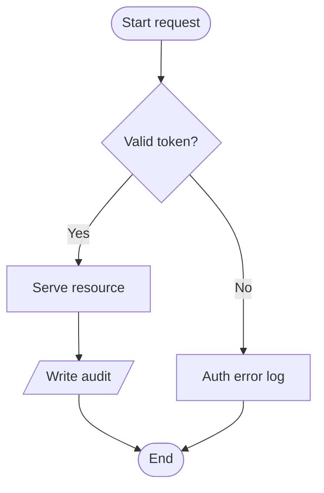
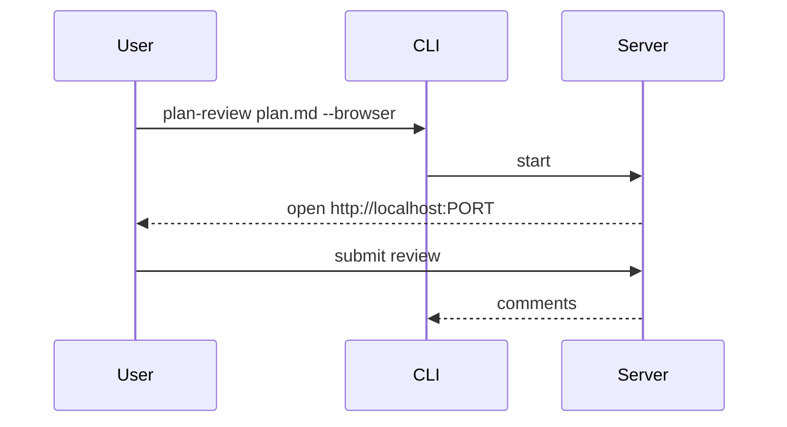
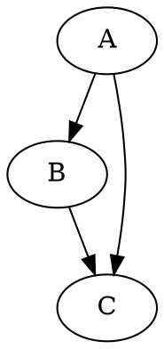
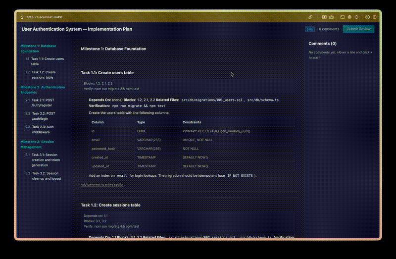

# Renderer Fixture

A single-file smoke test for every markdown structure the browser and terminal renderers should handle. Used to triage formatting bugs.

## Paragraphs and inline formatting

Regular paragraph with **bold**, *italic*, ***bold italic***, ~~strikethrough~~, `inline code`, and a [link](https://example.com). Hard line break:\
new line here. Soft wrap
continues on the next line.

Escape chars: \*not italic\* \_not italic\_ \`not code\`.

## Headings (levels 3-6 inside a section)

### Level 3

#### Level 4

##### Level 5

###### Level 6

## Lists

### Unordered, nested

- one
  - one-a
    - one-a-i
  - one-b
- two
- three with **bold** and `code`

### Ordered, nested

1. first
2. second
   1. two-a
   2. two-b
3. third

### Mixed

1. outer ordered
   - inner unordered
     1. inner-inner ordered
   - another inner
2. back to outer

### GitHub task list

- [ ] unchecked
- [x] checked
- [ ] nested parent
  - [x] nested child done
  - [ ] nested child todo

## Blockquotes

> Single-level quote.

> Nested:
>
> > Level 2
> >
> > > Level 3 with `code` and **bold**.

> Quote containing a code block:
>
> ```js
> const x = 1;
> ```

## Code blocks

Inline `code` and a plain fence:

```
plain fenced block, no language
```

Language-tagged fence:

```ts
function greet(name: string): string {
  return `Hello, ${name}!`;
}
```

Long line that should wrap or scroll (no hidden overflow please):

```
this is a very long line in a code block that should handle horizontal overflow gracefully without breaking layout or being silently clipped by CSS max-width
```

## Mermaid

Flowchart (exercises all 6 roles + yes/no branches):



Sequence diagram:



## Other fenced diagram languages

Plain dot/graphviz (expected: rendered as code or degraded cleanly, not crash):



## Tables

Basic:

| col a | col b | col c |
|-------|-------|-------|
| 1     | 2     | 3     |
| 4     | 5     | 6     |

With alignment:

| left | center | right |
|:-----|:------:|------:|
| l    | c      | r     |
| ll   | cc     | rrrr  |

With inline formatting in cells:

| term | meaning |
|------|---------|
| `cmd` | runs a **command** with [docs](https://example.com) |
| `flag` | passes *an option* |

## Images

Local path (may or may not resolve depending on how plan-review handles relative paths):



Remote URL:


## Links

Auto-link: <https://anthropic.com>

Reference-style: this is a [ref link][1] and here is [another][2].

[1]: https://example.com "Example"
[2]: https://github.com/alvaroaac/plan-review

## Footnotes

Here's a claim with a footnote[^note1]. And a second[^note2].

[^note1]: The first footnote body.
[^note2]: The second one, with `code` and **bold**.

## Math

Inline: $E = mc^2$ and a longer one $\sum_{i=1}^{n} i = \frac{n(n+1)}{2}$.

Display:

$$
f(x) = \int_{-\infty}^{\infty} \hat f(\xi)\, e^{2 \pi i \xi x}\, d\xi
$$

## Inline HTML

<kbd>Ctrl</kbd> + <kbd>C</kbd> to copy. H<sub>2</sub>O and E = mc<sup>2</sup>.

<details>
<summary>Click to expand</summary>

Hidden content with **formatting** and a `code` sample.

</details>

## Admonitions / callouts

> [!NOTE]
> GitHub-style note admonition.

> [!WARNING]
> GitHub-style warning admonition.

:::note
Docusaurus-style note admonition.
:::

:::tip
Docusaurus tip with **inline formatting** and `code`.
:::

## Horizontal rules

Above this line.

---

Below this line.

## Emoji

Shortcodes: :tada: :rocket: :warning: (may or may not expand).

Unicode: 🎉 🚀 ⚠️ (should always render).

## Hard edge cases

Fence containing triple-backtick:

````md
```js
// nested fence
```
````

Mixed HTML + markdown in a blockquote:

> <kbd>Enter</kbd> to submit, or *cancel* and [try again](#).

Long word: supercalifragilisticexpialidocious-plus-a-lot-more-characters-to-see-how-wrapping-behaves-in-tight-layouts.
